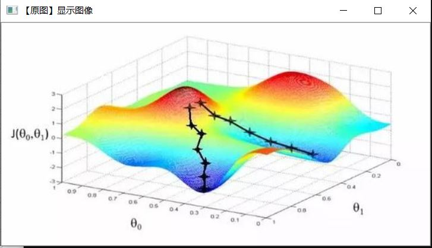
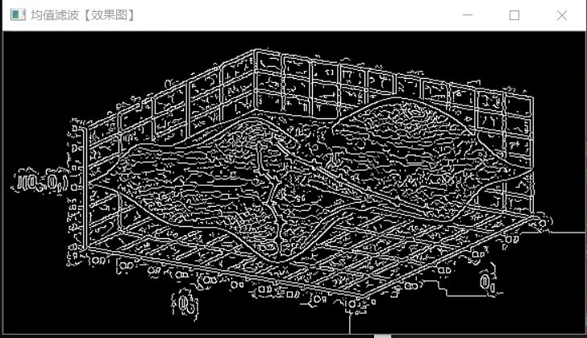
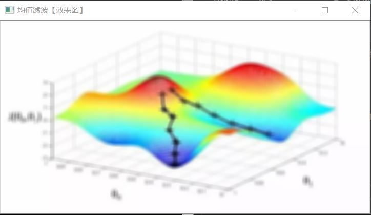
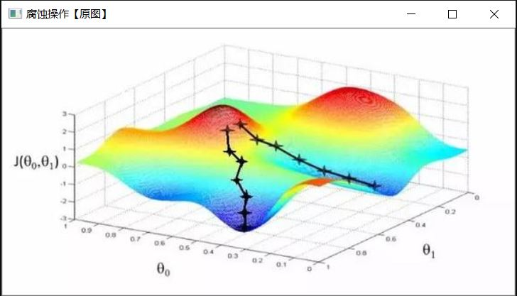
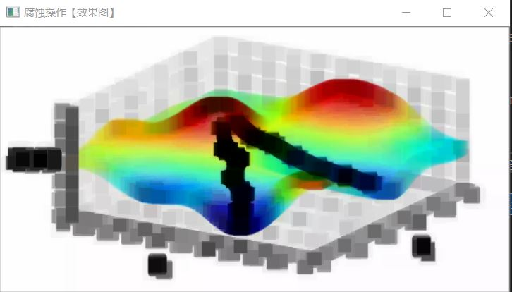
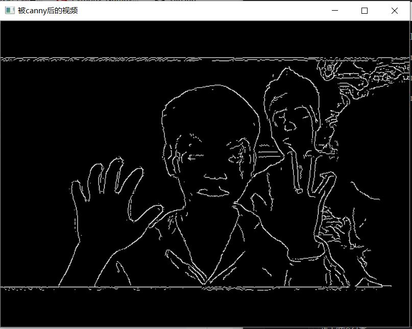
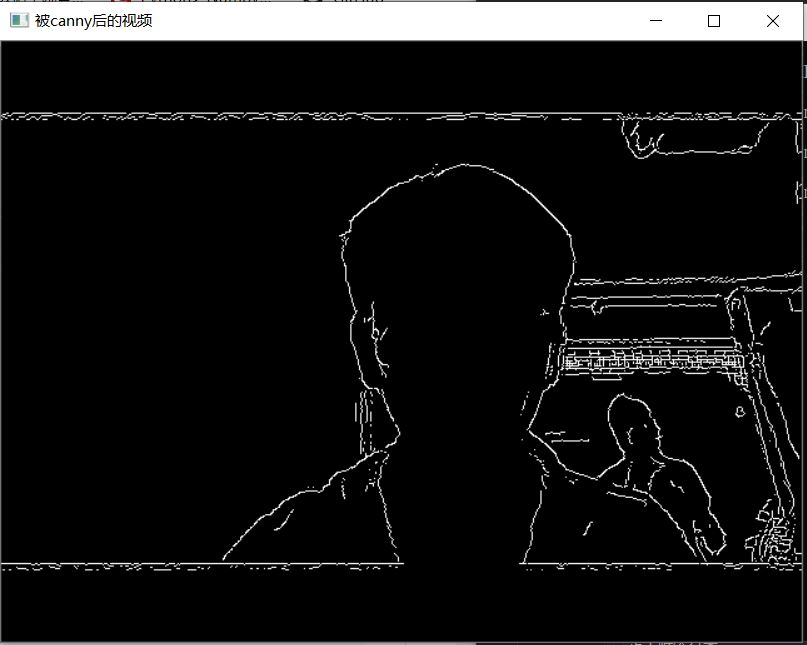

# 图像canny边缘检测

```c++
#include <opencv2/highgui/highgui.hpp>
#include<opencv2/imgproc/imgproc.hpp>
#include<opencv2/core/core.hpp>
#include<opencv2/opencv.hpp>
#include<stdlib.h>
#include<stdio.h>
#include<iostream>

using namespace std;
using namespace cv;

int main()
{
	//加载图像
	Mat image = imread("D:/秦嘉豪/华五_暖憶/图标/下载.jpg");
	
	if (image.empty())
	{
		cout << "can not find the image!" << endl;
	}

	imshow("【原图】显示图像", image);
	Mat greyImage, edge; //参数定义

	//[one] 将原图转化为灰度图像
	cvtColor(image, greyImage, COLOR_BGR2GRAY);
	
	//[two] 先使用3 X 3内核降噪
	blur(greyImage, edge, Size(3, 3));

	//[three] 运行Canny算子
	Canny(edge, edge, 3, 9, 3);

	//[four] 显示效果图
	imshow("均值滤波【效果图】", edge);
	
	//按任意键结束
	waitKey(0);
	return 0;
}
```

| --                                               | --                                               |
| ------------------------------------------------ | ------------------------------------------------ |
|  |  |


# 图像模糊


```c++
#include <opencv2/highgui/highgui.hpp>
#include<opencv2/imgproc/imgproc.hpp>
#include<opencv2/core/core.hpp>
#include<opencv2/opencv.hpp>
#include<stdlib.h>
#include<stdio.h>
#include<iostream>

using namespace std;
using namespace cv;

int main()
{
	//加载图像
	Mat image = imread("D:/秦嘉豪/华五_暖憶/图标/下载.jpg");

	if (image.empty())
	{
		cout << "can not find the image!" << endl;
	}

	//显示图像
	imshow("均值滤波【原图】", image);

	//进行均值滤波操作
	Mat dstImage;

	//使用7x7内核降噪
	blur(image, dstImage, Size(7, 7));

	//显示效果图
	imshow("均值滤波【效果图】", dstImage);

	waitKey(0);

	return 0;
}
```


| --                                               | --                                               |
| ------------------------------------------------ | ------------------------------------------------ |
|  |  |

# 图像腐蚀

```c++
#include <opencv2/highgui/highgui.hpp>
#include<opencv2/imgproc/imgproc.hpp>
#include<opencv2/core/core.hpp>
#include<opencv2/opencv.hpp>
#include<stdlib.h>
#include<stdio.h>
#include<iostream>

using namespace std;
using namespace cv;


int main()
{
	//加载图像
	Mat image = imread("D:/秦嘉豪/华五_暖憶/图标/下载.jpg");

	if (image.empty())
	{
		cout << "can not find the image!" << endl;
	}

	imshow("腐蚀操作【原图】", image);

	//进行腐蚀操作
	Mat eleImage = getStructuringElement(MORPH_RECT, Size(15, 15));
	Mat dstImage;
	erode(image, dstImage, eleImage);

	imshow("腐蚀操作【效果图】", dstImage);
	
	waitKey(0);

	return 0;
}
```

| --                                               | --                                               |
| ------------------------------------------------ | ------------------------------------------------ |
|  |  |

# 调用摄像头采集图像

```c++
#include <opencv2/highgui/highgui.hpp>
#include<opencv2/imgproc/imgproc.hpp>
#include<opencv2/core/core.hpp>
#include<opencv2/opencv.hpp>
#include<stdlib.h>
#include<stdio.h>
#include<iostream>

using namespace std;
using namespace cv;

int main()
{
	// 1. 从摄像头读入视频
	VideoCapture capture(0);
	Mat edges;

	// 2. 循环显示每一帧
	while (1)
	{
		// 1. 读入图像
		Mat frame;  //定义Mat变量，用于储存每一帧的图像
		capture >> frame;  // 读取当前帧

		// 2. 将原图转为灰度图
		cvtColor(frame, edges, COLOR_BGR2GRAY); //转化RGB彩图为灰度图

		// 3. 使用3x3内核降噪(2x3+1=7)
		blur(edges, edges, Size(7, 7));

		// 4. 进行canny边缘检测并显示
		Canny(edges, edges, 0, 30, 3);

		imshow("被canny后的视频", edges);  //显示当前帧
		if (waitKey(30) >= 0)
			break;
	}
	return 0;
}
```

| --                                               | --                                               |
| ------------------------------------------------ | ------------------------------------------------ |
|  |  |

