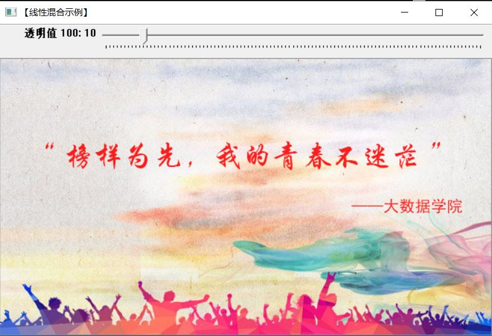
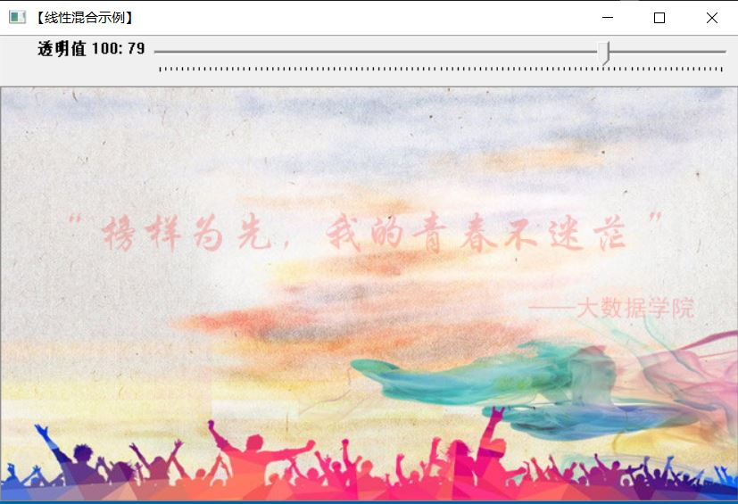
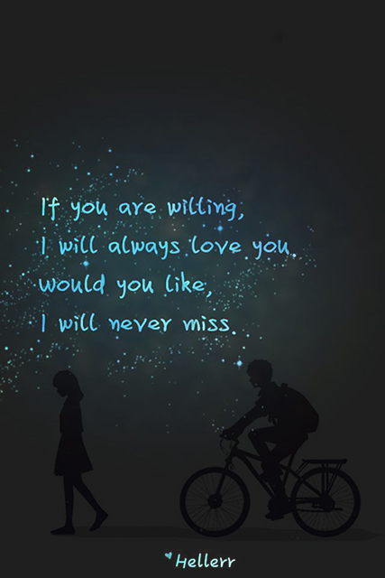
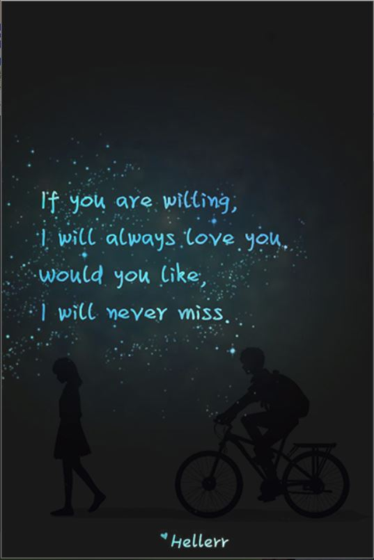
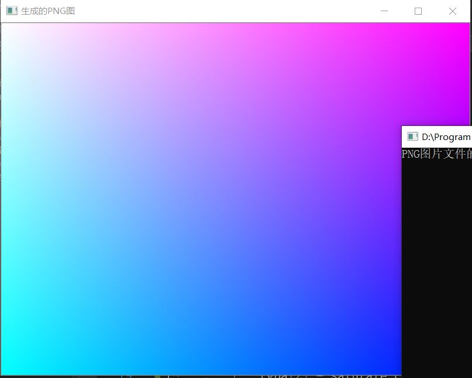
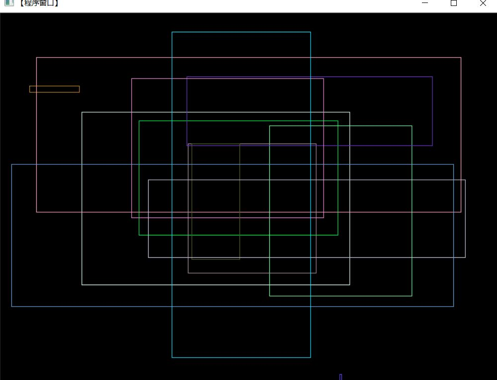

# 两张图片的Alpha混合

```c++
#include <opencv2/highgui/highgui.hpp>
#include<opencv2/imgproc/imgproc.hpp>
#include<opencv2/core/core.hpp>
#include<opencv2/opencv.hpp>
#include<stdlib.h>
#include<stdio.h>
#include<iostream>

#define WINDOWS_NAME "【线性混合示例】"

using namespace std;
using namespace cv;

//全局变量声明
const int g_nMaxAlphaValue = 100; //Alpha的最大值
int g_nAlphaValueSlider;  //滑动条对应的变量
double g_dAlphaValue;
double g_dBetaValue;

//声明储存图像的变量
Mat g_srcImageA;
Mat g_srcImageB;
Mat g_dstImage;

void on_Trackbar(int, void *)
{
	//求出当前的Alpha值所占的比例
	g_dAlphaValue = (double)g_nAlphaValueSlider / g_nMaxAlphaValue;

	//bete值为1减去Alpha的值
	g_dBetaValue = (1.0 - g_dAlphaValue);

	//根据当前的Alpha的值跟beta值进行线性混合
	addWeighted(g_srcImageA, g_dAlphaValue, g_srcImageB, g_dBetaValue, 0.0, g_dstImage);

	//显示效果图
	imshow(WINDOWS_NAME, g_dstImage);
}

int main()
{
	//加载图像（两张图片的大小尺寸必须相等）
	g_srcImageA = imread("D://秦嘉豪//Pictures//1_170621165119_1.jpg");
	g_srcImageB = imread("D://秦嘉豪//Pictures//1_170621165119_11.jpg");
	if (!g_srcImageA.data) {
		cout << "can not find the imageA!" << endl;
		return -1;
	}
	if (!g_srcImageB.data) {
		cout << "can not find the imageB!" << endl;
		return -1;
	}

	//设置滑动初始值
	g_nAlphaValueSlider = 70;

	//创建窗体
	namedWindow(WINDOWS_NAME, 1);

	//在窗体中创建一个滑动条
	char TrackbarName[50];
	sprintf_s(TrackbarName, "透明值 %d", g_nMaxAlphaValue);

	createTrackbar(TrackbarName, WINDOWS_NAME, &g_nAlphaValueSlider,
		g_nMaxAlphaValue, on_Trackbar);

	//结果在回调函数中显示
	on_Trackbar(g_nAlphaValueSlider, 0);

	//按任意键结束
	waitKey(0);

	return 0;
}
```

|                         --                         |                         --                         |
| :------------------------------------------------: | :------------------------------------------------: |
|    |   |
|  |  |

# 透明Alpha值图

```c++
#include <opencv2/highgui/highgui.hpp>
#include<opencv2/imgproc/imgproc.hpp>
#include<opencv2/core/core.hpp>
#include<opencv2/opencv.hpp>
#include<stdlib.h>
#include<stdio.h>
#include<iostream>

using namespace std;
using namespace cv;

void creatAlphaMat(Mat &mat)
{
	for (int i = 0; i < mat.rows; i++) {
		for (int j = 0; j < mat.cols; j++) {
			Vec4b&rgba = mat.at<Vec4b>(i, j);
			rgba[0] = UCHAR_MAX;
			rgba[1] = saturate_cast<uchar>((float(mat.cols - j)) / ((float)mat.cols) * UCHAR_MAX);
			rgba[2] = saturate_cast<uchar>((float(mat.rows - i)) / ((float)mat.rows) * UCHAR_MAX);
			rgba[3] = saturate_cast<uchar>(0.5 * (rgba[1] + rgba[2]));
		}
	}
}

int main()
{
	//创建带Alpha通道的Mat
	Mat mat(480, 640, CV_8UC4);
	creatAlphaMat(mat);

	vector<int> compression_params;

	compression_params.push_back(IMWRITE_PNG_COMPRESSION);
	compression_params.push_back(9);

	try {
		imwrite("D://秦嘉豪//Pictures//001.jpg",mat, compression_params);
		imshow("生成的PNG图", mat);
		fprintf(stdout, "PNG图片文件的Alpha数据保存完毕\n");
		waitKey(0);
	}
	catch (runtime_error & ex) {
		fprintf(stderr, "图像转换为PNG格式发生错误：%s\n", ex.what());
		return 1;
	}
	return 0;
}
```



# 鼠标交互

```c++
#include <opencv2/highgui/highgui.hpp>
#include<opencv2/imgproc/imgproc.hpp>
#include<opencv2/core/core.hpp>
#include<opencv2/opencv.hpp>
#include<stdlib.h>
#include<stdio.h>
#include<iostream>

using namespace std;
using namespace cv;

#define	WINDOW_NAME "【程序窗口】"

// 全局函数的声明
void on_MouseHandle(int enent, int x, int y, int flags, void* param);
void DrawRectangle(cv::Mat& img, cv::Rect box);

//全局变量的声明
Rect g_rectangle;  //绘制方形
bool g_bDrawingBox = false;  //是否进行绘制
RNG g_rng(12345);

//鼠标回调函数
void on_MouseHandle(int event, int x, int y, int flags, void* param)
{
	Mat image = *(cv::Mat*) param;
	switch (event)
	{
		// 鼠标移动消息
	case EVENT_MOUSEMOVE:
	{
		// 如果进行绘制的标识符为真，则记录下长和宽到RECT变量当中
		if (g_bDrawingBox)
		{
			g_rectangle.width = x - g_rectangle.x;
			g_rectangle.height = y - g_rectangle.y;
		}
	}
	break;

	case EVENT_LBUTTONDOWN:
	{
		g_bDrawingBox = true;
		g_rectangle = Rect(x, y, 0, 0);
	}
	break;

	case EVENT_LBUTTONUP:
	{
		// 标识符设置为false
		g_bDrawingBox = false;

		// 对于宽和高小于0的处理
		if (g_rectangle.width < 0)
		{
			g_rectangle.x += g_rectangle.width;
			g_rectangle.width *= -1;
		}

		if (g_rectangle.height < 0)
		{
			g_rectangle.y += g_rectangle.height;
			g_rectangle.height *= -1;
		}

		// 调用函数进行绘制
		DrawRectangle(image, g_rectangle);
	}
	break;
	default:
		break;
	}
}

void DrawRectangle(cv::Mat& img, cv::Rect box)
{
	rectangle(img, box.tl(), box.br(), Scalar(g_rng.uniform(0, 255),
		g_rng.uniform(0, 255), g_rng.uniform(0, 255)));  //随机颜色
}

int main()
{
	// 1. 准备参数
	g_rectangle = Rect(-1, -1, 0, 0);
	Mat srcImage(600, 800, CV_8UC3), tempImage;
	srcImage.copyTo(tempImage);
	g_rectangle = Rect(-1, -1, 0, 0);
	srcImage = Scalar::all(0);

	// 2. 设置鼠标操作回调函数
	namedWindow(WINDOW_NAME);
	setMouseCallback(WINDOW_NAME, on_MouseHandle, (void *)&srcImage);

	// 3. 程序主循环
	// 当进行绘制的图标为真时，进行绘制
	while (1)
	{
		// 复制原图到临时变量
		srcImage.copyTo(tempImage);
		if (g_bDrawingBox)
			DrawRectangle(tempImage, g_rectangle);
		imshow(WINDOW_NAME, tempImage);
		// 按ESC退出
		if (waitKey(10) == 27)
			break;
	}
	return 0;
}
```

